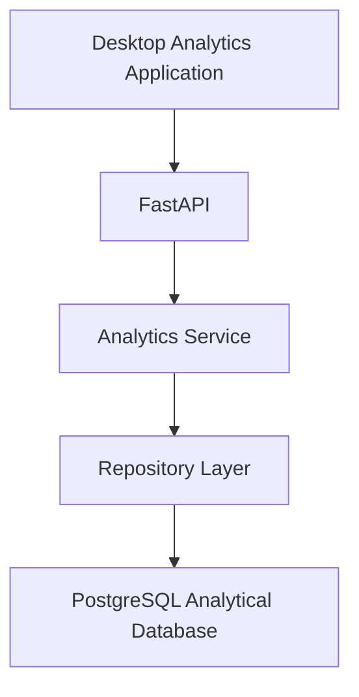

# Analytics & Reporting Application

A technical case study of an internal analytics application designed to provide fast, controlled access to large operational datasets through a desktop interface backed by Python, FastAPI, and PostgreSQL.

The application allows users to search, filter, and explore detailed analytical records without working directly with raw files or database queries.

> **Note:** This repository documents a real production-style analytics application. Production source code, operational datasets, credentials, internal systems, and confidential business information are intentionally excluded.

---

## Project Overview

This project was designed to provide business users with a dedicated analytics interface for exploring a large operational dataset.

Instead of requiring users to:

- Work directly with large CSV files
- Write SQL queries
- Search through spreadsheets manually
- Access the production database directly

the application provides a controlled desktop interface connected to a dedicated analytical data layer.

The system combines:

- Python
- PySide / Qt
- FastAPI
- PostgreSQL
- SQL
- API-based communication
- Controlled analytical access

---

## Business Problem

Operational data contained millions of detailed records and dozens of analytical fields.

Working directly with the underlying data created several challenges:

- Large files were difficult to explore manually
- Spreadsheet-based filtering became inefficient at scale
- Direct database access was not appropriate for all users
- Users needed multiple filters to locate specific records
- Large result sets required efficient pagination
- Dropdown filters needed to reflect real values from the analytical dataset
- Long-running queries needed to remain controlled
- The interface needed to remain usable even with complex filtering requirements

The goal was to create a dedicated analytics application that made large datasets easier to explore while keeping database access controlled and predictable.

---

## Solution

I designed the application using a layered architecture:

```text
Desktop Application
        ↓
FastAPI
        ↓
Analytics Service
        ↓
Repository Layer
        ↓
PostgreSQL
```

Each layer has a specific responsibility.

This separation helps keep:

- User-interface logic
- API logic
- analytical rules
- database access

independent from one another.

---

## Architecture



The desktop application never needs to communicate directly with PostgreSQL.

Instead, requests move through the API and service layers before reaching the database.

This creates a controlled analytical boundary between the user interface and the underlying data.

---

## Desktop Application

The user interface was built using **Python and PySide / Qt**.

The application provides a desktop environment for exploring operational data using structured filters.

The interface includes:

- Searchable dropdowns
- Date-range filters
- Text filters
- Dependent filters
- Collapsible filter panels
- Scrollable filter areas
- Paginated results
- Large tabular result views

The objective was to make complex analytical filtering accessible without requiring users to write SQL.

---

## Analytical Filters

The application supports multiple optional filters.

Examples include:

- Booking date
- Travel date
- Agency
- Supplier
- Branch
- Airline
- Client
- Booking reference
- System reference
- Status

Users can combine filters to narrow large datasets to the specific records they need.

Filters remain optional so users can perform both broad and highly targeted searches.

---

## Searchable Dropdowns

Several fields use searchable dropdown controls rather than free-text entry.

This helps:

- Reduce invalid input
- Improve usability
- Keep filtering consistent with database values
- Allow users to search through large option lists

Dropdown values are populated from the approved analytical dataset rather than being hard-coded into the interface.

---

## Dependent Filters

Some filter values depend on another selected field.

For example:

```text
Supplier
   ↓
Available Related Options
```

When the parent selection changes, dependent options can be refreshed dynamically.

This reduces irrelevant choices and improves the filtering experience.

---

## Date Filtering

The application supports inclusive date-range filtering.

Users can specify:

```text
From Date
To Date
```

or use only one side of the range.

Conceptually:

```text
From only
→ records on or after the selected date

To only
→ records on or before the selected date

From + To
→ records inside the selected date range
```

Date handling is performed consistently between the desktop application, API, and database query layer.

---

## FastAPI Layer

The application uses **FastAPI** as the interface between the desktop client and the analytical backend.

The API is responsible for:

- Receiving filter requests
- Validating request parameters
- Calling the analytics service
- Returning structured results
- Providing pagination information
- Handling invalid requests
- Exposing controlled analytical endpoints

Using an API boundary prevents the desktop interface from containing direct database logic.

---

## Analytics Service

The analytics service contains the application-level rules for querying data.

Responsibilities include:

- Processing filter requests
- Applying analytical constraints
- Managing pagination state
- Coordinating database access
- Returning structured results to the API layer

This separates business and analytical logic from both the UI and the database adapter.

---

## Repository Layer

Database operations are isolated inside a repository layer.

This provides a single controlled location for analytical database access.

Benefits include:

- Easier query maintenance
- Separation of SQL from UI logic
- Controlled access patterns
- Easier testing
- Easier migration between database implementations

---

## PostgreSQL Analytical Database

PostgreSQL provides the analytical data source used by the application.

The analytical layer is designed for read-oriented workloads.

The application uses a dedicated read-only service account rather than exposing unrestricted database access.

This helps maintain a clear separation between:

```text
Operational / Processing Systems
            ↓
Approved Analytical Data
            ↓
Read-Only Application Access
```

---

## Large Dataset Pagination

Traditional pagination using large `OFFSET` values becomes increasingly inefficient as datasets grow.

The application therefore uses **keyset pagination**.

Instead of requesting:

```text
page 10000
```

using a large offset, the application continues from the last known record.

Conceptually:

```text
First 200 records
        ↓
Last record becomes cursor
        ↓
Next 200 records
        ↓
New cursor
        ↓
Continue
```

This provides more predictable performance when browsing large result sets.

---

## Stable Query Results

Large datasets can continue changing while a user is browsing results.

To reduce inconsistencies between pages, the application maintains query-state information while pagination is active.

This allows the backend to determine whether the underlying analytical dataset has changed during a user's browsing session.

If the dataset version becomes incompatible with the existing paging state, the application can reject the stale request rather than silently returning inconsistent pages.

---

## Controlled Data Refresh

The analytical dataset can be refreshed independently from the desktop application.

The application tracks dataset state so users do not unknowingly continue browsing an outdated pagination sequence after a major data replacement or revision.

This provides stronger consistency between:

- Database state
- API results
- Desktop pagination

---

## Filter Panel Design

The interface contains a collapsible filter area.

After a search is performed, users can collapse the filter panel to give more screen space to the results.

Filter values remain preserved when the panel is collapsed.

This allows users to:

1. Configure filters
2. Run a search
3. Collapse the filter area
4. Explore the results
5. Reopen the filters without losing the existing selections

---

## Responsive Desktop Layout

Desktop applications still need to handle different screen sizes.

The filter area therefore uses an internal vertical scroll area.

When the application window becomes shorter:

```text
Filter controls keep their intended size
        ↓
Filter area becomes scrollable
        ↓
Results section remains separate
```

This prevents controls from becoming compressed or inaccessible.

---

## Data Access Controls

The application follows a controlled-access design.

Important principles include:

- Read-only application database access
- Approved analytical dataset only
- No direct operational-database editing
- Controlled API endpoints
- Validated filter parameters
- Defined reporting boundary

This allows users to explore analytical data without gaining unrestricted access to the underlying database environment.

---

## Technologies

### Application

- Python
- PySide / Qt

### Backend

- FastAPI
- Python

### Database

- PostgreSQL
- SQL

### Architecture

- Service layer
- Repository pattern
- API-based communication
- Read-only analytical access

### Development

- Git
- VS Code

---

## Key Technical Challenges

| Challenge | Approach |
|---|---|
| Exploring millions of records | Used PostgreSQL as the centralized analytical layer |
| Browsing large result sets | Implemented keyset cursor pagination |
| Complex filtering | Built structured optional filters |
| Large dropdown option lists | Added searchable database-backed dropdowns |
| Related filter values | Implemented dependent filter behavior |
| Avoiding direct database access from the UI | Introduced FastAPI and service layers |
| Maintaining paging consistency | Added dataset-state validation |
| Protecting analytical data | Used read-only application access |
| Limited screen space | Added collapsible and scrollable filter areas |
| Maintaining clean architecture | Separated UI, API, service, repository, and database responsibilities |

---

## Design Principles

### Separation of Concerns

The desktop interface, API, analytical logic, and database access are maintained as separate responsibilities.

### Read-Only Analytics

The application is designed for analytical exploration rather than operational data modification.

### Scalable Pagination

Large datasets are browsed using cursor-based pagination rather than increasingly expensive offsets.

### Controlled Access

Users interact with approved analytical data through defined application interfaces.

### Reusable Filters

Filtering logic is designed to remain consistent across the application rather than being implemented independently in multiple places.

### Usability at Scale

The application must remain usable even when the underlying dataset contains millions of rows and many available filters.

---

## Repository Structure

This repository is intentionally structured as a **technical case study** rather than a public copy of the production application.

```text
analytics-reporting-application/
│
├── README.md
│
├── docs/
│   ├── technical-architecture.md
│   └── pagination-and-query-design.md
│
├── diagrams/
│   └── README.md
│
├── assets/
│   └── README.md
│
└── .gitignore
```

Production source code and operational datasets are intentionally excluded.

---

## Data Privacy & Confidentiality

This repository is based on a real production-style analytics application.

To protect confidential business information, it does **not** contain:

- Production source code
- Operational datasets
- Customer or passenger information
- Database credentials
- Internal URLs
- Authentication details
- Production infrastructure configuration
- Proprietary business logic

The repository focuses on architecture, technical decisions, analytical design, scalability, and usability.

---

## Skills Demonstrated

This project demonstrates practical experience with:

- Python
- SQL
- PostgreSQL
- FastAPI
- PySide / Qt
- API design
- Desktop application development
- Large-scale data querying
- Keyset pagination
- Searchable filters
- Dependent filters
- Database-backed applications
- Repository pattern
- Service-layer architecture
- Read-only analytical access
- Data exploration
- Application usability
- Git-based version control

---

## Project Focus

The objective of this project was to make a large operational dataset easier and safer to explore.

The result is a layered analytics application that combines:

**Data Analytics • Python Development • SQL • PostgreSQL • API Design • Application Architecture**
